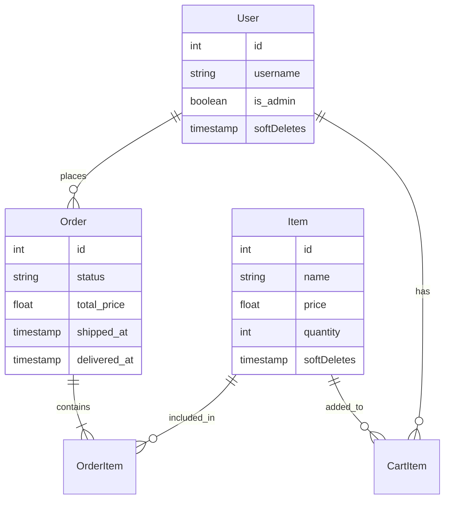
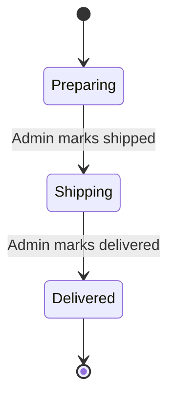

# Apple Store Clone 🍎

A high-performance, pixel-perfect clone of the Apple Store, built with Laravel 11. This project mimics the visual aesthetic and user experience of the official Apple website while providing a fully functional e-commerce backend.

## Features
- **Offline Capability**: All assets (images, fonts) are served locally, allowing the app to run without an internet connection.
- **Desktop Optimization**: A strictly enforced desktop-first layout with a 3-column grid, optimized for large screens.
- **Order Tracking**: Detailed timeline for every order (Ordered -> Shipped -> Delivered) with visual status indicators.
- **Admin Panel**: A powerful dashboard to manage users, products, and order statuses with a split view for active/delivered orders.
- **Secure Authentication**: Custom authentication system with role-based access control (Admin vs. User).

## Installation
1.  Clone the repository.
2.  Run `composer install`.
3.  Copy `.env.example` to `.env` and configure `DB_CONNECTION=sqlite`.
4.  Run `php artisan key:generate`.
5.  Run `php artisan migrate:fresh --seed`.
6.  Serve with `php artisan serve`.

## Admin Credentials
- **URL**: `/admin/dashboard`
- **Username**: `admin`
- **Password**: `12345678`

---

# Technical Architecture 🏗️

## 1. Project Structure

Here is where the key files for this project are located within the Laravel framework:

```text
apple/
├── app/
│   ├── Http/
│   │   ├── Controllers/
│   │   │   ├── AdminController.php    <-- Backend logic (Dashboard, CRUD)
│   │   │   ├── AuthController.php     <-- Login/Register logic
│   │   │   └── StoreController.php    <-- Frontend logic (Cart, Checkout)
│   │   └── Middleware/                <-- Auth checks
│   ├── Models/
│   │   ├── Item.php                   <-- Product model
│   │   ├── Order.php                  <-- Order model
│   │   └── User.php                   <-- User model
│   └── Providers/
│       └── AppServiceProvider.php     <-- Defines 'admin' Gate
├── database/
│   ├── migrations/                    <-- Database schema definitions
│   └── seeders/
│       └── DatabaseSeeder.php         <-- Populates initial data (iPhones, Admin)
├── public/
│   ├── css/
│   │   └── style.css                  <-- Custom Apple-style CSS
│   └── images/
│       └── products/                  <-- Local product images
├── resources/
│   └── views/
│       ├── admin/
│       │   └── dashboard.blade.php    <-- Admin panel view
│       ├── layouts/
│       │   └── app.blade.php          <-- Master layout (Navbar, Footer)
│       └── store/
│           ├── cart.blade.php         <-- Cart & Order History
│           ├── index.blade.php        <-- Main Storefront
│           └── show.blade.php         <-- Product Details
└── routes/
    └── web.php                        <-- Route definitions
```

## 2. Database Schema (ER Diagram)

The database follows a standard e-commerce relational model.



## 3. Deep Dive: User Journeys

### Journey 1: Buying an iPhone
This section traces the code execution path when a user buys a product.

1.  **View Product**: User visits `/item/{id}`.
    -   **Route**: `Route::get('/item/{id}', [StoreController::class, 'show'])`
    -   **Controller**: `StoreController@show` fetches the `Item`.
    -   **View**: `store/show.blade.php` renders the details.

2.  **Add to Cart**: User clicks "Add to Bag".
    -   **Route**: `Route::post('/cart/add/{id}', ...)`
    -   **Controller**: `StoreController@addToCart`
        -   Checks stock: `if ($item->quantity <= 0) ...`
        -   Creates/Updates `CartItem` record.
        -   **Redirect**: Returns `back()` with `session('cart_success')`.
    -   **View**: `show.blade.php` detects the session flash and displays the **Success Modal**.

3.  **Checkout**: User clicks "Check Out" in the cart.
    -   **Route**: `Route::get('/checkout', ...)`
    -   **Controller**: `StoreController@checkout` calculates total.
    -   **View**: `store/checkout.blade.php` displays the form.

4.  **Process Order**: User submits shipping info.
    -   **Route**: `Route::post('/order', ...)`
    -   **Controller**: `StoreController@processOrder`
        -   **Transaction**:
            1.  Creates `Order` record.
            2.  Iterates `CartItems` -> creates `OrderItems` (snapshotting price).
            3.  Deletes `CartItems`.
    -   **Result**: User is redirected to the receipt page.

### Journey 2: Admin Fulfillment
How an admin processes an order.

1.  **View Dashboard**: Admin logs in.
    -   **Middleware**: `auth` AND `can:admin` (Gate check).
    -   **Controller**: `AdminController@dashboard` fetches `Order::where('status', '!=', 'delivered')`.

2.  **Update Status**: Admin clicks "Mark as Shipped".
    -   **Route**: `Route::patch('/admin/orders/{id}', ...)`
    -   **Controller**: `AdminController@updateOrder`
        -   Updates `status` column.
        -   **Logic**: `if ($status == 'shipping') $order->shipped_at = now();`
    -   **Result**: The order moves visually in the user's timeline.

## 4. Eloquent Models & Logic

### `Item` Model
- **Soft Deletes**: We use `SoftDeletes` so that if an admin deletes an iPhone, it doesn't disappear from past order receipts.
```php
class Item extends Model
{
    use SoftDeletes;
    protected $fillable = ['name', 'description', 'price', 'image_path', 'quantity'];
    
    // Relationships
    public function orderItems() { return $this->hasMany(OrderItem::class); }
}
```

### `Order` Model
- **Logic**: The `orderItems` relationship is critical for calculating totals and displaying receipts.
```php
class Order extends Model
{
    use SoftDeletes;
    protected $fillable = ['user_id', 'status', 'total_price', ...];

    public function orderItems()
    {
        return $this->hasMany(OrderItem::class);
    }
}
```

## 5. Views & Frontend Architecture (Blade Templates)

The frontend uses Laravel's **Blade** templating engine.

### Order Lifecycle Visualization
We use a timeline approach to show order status.



### Blade Syntax Examples

#### Loops `@foreach`
Used to iterate over lists of items or orders.
```blade
<!-- store/cart.blade.php -->
@foreach($activeOrders as $order)
    <tr>
        <td>#{{ $order->id }}</td>
        <td>{{ ucfirst($order->status) }}</td>
    </tr>
@endforeach
```

#### Conditionals `@if` / `@else`
Used to show different content based on logic (e.g., stock status).
```blade
<!-- store/show.blade.php -->
@if($item->quantity > 0)
    <button type="submit">Add to Bag</button>
@else
    <button disabled>Out of Stock</button>
@endif
```

#### Authentication `@auth`
Used to show content only to logged-in users.
```blade
<!-- layouts/app.blade.php -->
@auth
    <a href="{{ route('cart.view') }}">Cart</a>
@else
    <a href="{{ route('login') }}">Login</a>
@endauth
```

## 6. Troubleshooting & Common Issues

During development, we addressed several key issues:

-   **419 Page Expired**:
    -   *Cause*: Missing CSRF token in forms.
    -   *Fix*: Added `@csrf` directive to all forms (`<form>@csrf ...</form>`).

-   **403 Unauthorized (Admin)**:
    -   *Cause*: Middleware was blocking access because the Gate wasn't defined.
    -   *Fix*: Defined `Gate::define('admin', ...)` in `AppServiceProvider.php`.

-   **Mass Assignment Error**:
    -   *Cause*: `OrderItem` model didn't have `$fillable` properties.
    -   *Fix*: Added `protected $fillable = ['order_id', 'item_id', ...];` to the model.

-   **RelationNotFoundException**:
    -   *Cause*: Calling `with('items')` on Order model instead of `with('orderItems')`.
    -   *Fix*: Updated controller to use the correct relationship name defined in `Order.php`.
